# RFP Response Intelligence Copilot

Sales and presales teams lose days answering RFPs because the evidence is scattered across proposals, product docs, security questionnaires, compliance policies, and pricing notes.

This copilot ingests approved enterprise documents, retrieves grounded evidence, builds a requirement matrix, adapts guidance to customer profiles, reuses approved local response snippets, converts accepted answers into a governed Answer Reuse Library under `storage/answer_reuse_library/` with owner, expiry, reuse decision, and citation lineage, drafts cited RFP answers, exports interview-ready response packages, creates stakeholder handoff boards, creates Reviewer Collaboration Pack artifacts under `storage/review_boards/` with local assignments, decision comments, approvals, and redline summaries, writes Reviewer Signoff Ledger artifacts under `storage/reviewer_signoffs/` with durable signoff readiness, policy gates, transition logs, and human review queues, generates Submission Exception Register artifacts under `storage/exception_registers/` with waiver types, approvers, expiry, and evidence requirements, scores deal readiness, writes Proposal Readiness Score Pack artifacts under `storage/readiness_packs/` with section completeness, evidence coverage, compliance risk, and reviewer bottlenecks, simulates competitive win strategy and pricing risk, generates cited Competitive Objection Handling Pack artifacts under `storage/objection_packs/`, learns from fake post-RFP win/loss outcomes with `POST /learning/win-loss` plus Strategy Pack artifacts under `storage/win_loss_packs/`, plans governed win/loss policy activation with `POST /learning/win-loss-policy` plus state-machine artifacts under `storage/win_loss_policy/`, compares retrieval policies with local diagnostics and governed shadow-eval recommendations via `POST /rag/retrieval-experiments` plus artifacts under `storage/retrieval_experiments/`, analyzes risky customer contract terms, plans evidence-gap remediation, scores source freshness with `GET /evidence/freshness` plus Expiry Risk Pack artifacts under `storage/freshness_packs/`, audits answer/draft citation lineage with `GET /evidence/citation-lineage` plus Integrity Pack artifacts under `storage/citation_lineage/`, consolidates source trust with `GET /evidence/source-trust` plus Source Trust Gate artifacts under `storage/source_trust/`, exports source request packs, orchestrates proposal timelines and submission calendar packs, executive risk reports, pricing memos, negotiation briefs, portfolio leadership briefs, and a final go/no-go submission decision memo, runs a deterministic submission regression gate, generates an interview demo script, writes a local launch checklist with API smoke matrix coverage, writes a Runtime Demo Server Pack under `storage/runtime_packs/`, proves RAG Corpus and eval coverage with `GET /rag/corpus-coverage` plus `POST /rag/eval-coverage-pack` artifacts under `storage/rag_coverage/`, maps regulated-enterprise controls with `GET /compliance/evidence-matrix` plus `POST /compliance/control-pack` artifacts under `storage/compliance_packs/`, creates a Model Risk Register with `GET /governance/model-risk-register` plus `POST /governance/model-risk-pack` artifacts under `storage/model_risk/`, simulates Procurement Q&A question risk with `GET /procurement/question-risk` plus `POST /procurement/approval-pack` Approval Workflow artifacts under `storage/procurement_packs/`, detects procurement risk desk issues with `GET /procurement/risk-desk` plus `POST /procurement/risk-desk-pack` owner-routed artifacts under `storage/procurement_risk_desk/`, simulates Bid/No-Bid pursuit scenarios with `GET /bid/scenario-analysis` plus `POST /bid/roi-pack` ROI Impact artifacts under `storage/bid_packs/` using risk-adjusted ROI math, writes buyer workflow, replay, structured output contract, agent council, and decision provenance packs under `storage/buyer_intelligence/`, `storage/buyer_contracts/`, `storage/agent_council/`, and `storage/decision_provenance/`, produces a Portfolio Evidence index and Interview Pack under `storage/portfolio_packs/`, generates a Reviewer Quickstart and Walkthrough Pack under `storage/reviewer_packs/`, generates an OpenAPI-derived API Contract Snapshot and Reviewer Collection Pack under `storage/api_contracts/`, generates a Release Candidate Quality Gate and GitHub Publish Pack under `storage/release_packs/`, writes a local Verification Evidence Pack under `storage/verification_evidence/` for pytest, ruff, eval, red-team, dashboard smoke, demo, release gate, final audit, artifact inventory, and reviewer signoff, exposes an Artifact Inventory and README Badge/Checklist Pack under `storage/artifact_indexes/`, verifies dashboard wiring with Dashboard Smoke and a UI Verification Pack under `storage/ui_verification/`, runs a README Consistency final audit and writes a Final Handoff Pack under `storage/final_handoff/`, flags missing support, and measures quality, latency, tokens, cost, and audit events.

## 30-Second Demo

```bash
python -m pip install -e ".[dev]"
python -m app.demo
python -m app.evals.run_eval --dataset sample_data/eval_dataset.json --top-k 4
python -m app.evals.run_red_team --dataset sample_data/red_team_questions.json --top-k 4
```

Expected result: twelve sample evidence documents load, requirements are extracted, a requirement matrix is created, customer profile fit and approved response memory matches are printed, a governed Answer Reuse Library count and pack path are printed under `storage/answer_reuse_library/`, a cited SSO/encryption answer is generated, a five-section draft is created, a Markdown/JSON export package is written under `storage/exports/`, review board findings are summarized, stakeholder task counts by owner are printed, a handoff board is written under `storage/handoffs/`, readiness and executive risk report paths are printed, an Amendment Impact Pack is written under `storage/amendment_impact/` from `sample_data/acme_enterprise_rfp_addendum.md`, a win score and pricing/competitor risk level are printed, a pricing memo is written under `storage/pricing_memos/`, sample contract risk score/status and a negotiation brief path are printed, evidence gap count/high severity count are printed, Evidence Freshness expiry risk and a Freshness Pack path are printed under `storage/freshness_packs/`, Citation Lineage integrity score and pack paths are printed under `storage/citation_lineage/`, Source Trust Gate status and pack paths are printed under `storage/source_trust/`, a source request pack is written under `storage/source_requests/`, timeline milestone count/blocked count are printed, a Submission Calendar Pack is written under `storage/submission_calendars/`, a consolidated leadership brief is written under `storage/leadership_briefs/`, a Submission Decision score and executive memo path are printed, the submission regression pass/fail is printed, an interview demo script is written under `storage/demo_scripts/`, launch readiness and a Launch Checklist artifact path are printed under `storage/launch_checklists/`, Runtime Demo readiness and a Runtime Demo Server Pack path are printed under `storage/runtime_packs/`, Provider Resilience status and a Runbook Pack path are printed under `storage/provider_resilience/`, RAG Corpus coverage and a RAG Eval Coverage Pack path are printed under `storage/rag_coverage/`, Compliance control coverage and a Control Mapping Pack path are printed under `storage/compliance_packs/`, Model Risk Register status and a pack path are printed under `storage/model_risk/`, Procurement question risk and an Approval Workflow Pack path are printed under `storage/procurement_packs/`, Procurement Risk Desk count/blocked rows and a pack path are printed under `storage/procurement_risk_desk/`, buyer workflow/replay, structured contract, agent council, and decision provenance packs are written under `storage/buyer_intelligence/`, `storage/buyer_contracts/`, `storage/agent_council/`, and `storage/decision_provenance/`, Reviewer Collaboration status, Reviewer Workflow checkpoint status, and pack paths are printed under `storage/review_boards/`, Reviewer Signoff Ledger status and pack paths are printed under `storage/reviewer_signoffs/`, Submission Exception Register status and a pack path are printed under `storage/exception_registers/`, Bid/No-Bid scenario count plus best risk-adjusted ROI are printed and an ROI Impact Pack is written under `storage/bid_packs/`, Competitive Objection Handling coverage/confidence is printed and a pack is written under `storage/objection_packs/`, Win/Loss Learning outcome count/win rate is printed, a Strategy Pack is written under `storage/win_loss_packs/`, a Policy Activation Pack is written under `storage/win_loss_policy/`, Retrieval Experiment recommendation/status is printed and a pack is written under `storage/retrieval_experiments/`, a portfolio evidence score/count and Interview Pack path are printed under `storage/portfolio_packs/`, Reviewer Quickstart status/count and a Walkthrough Pack path are printed under `storage/reviewer_packs/`, API Contract status/OpenAPI route count and a Reviewer Collection path are printed under `storage/api_contracts/`, a release gate status/score and Publish Pack path are printed under `storage/release_packs/`, an Artifact Inventory count and README Checklist artifact path are printed under `storage/artifact_indexes/`, Dashboard Smoke status and a UI Verification Pack path are printed under `storage/ui_verification/`, a README Consistency final audit status and Final Handoff Pack path are printed under `storage/final_handoff/`, and the deterministic standard and red-team evals print `Pass/fail summary: PASS`.

## Final Portfolio Demo Command

```bash
make brief
```

`make brief` runs `python -m app.demo` and prints a final screenshot-ready line like:

```text
Final demo summary: docs=12 requirements=13 coverage=1.0 citations=7 fit=95.0 tasks=13 readiness=100/ready readiness_pack=... amendment_impact=blocked_pending_amendment_review/... amendment_impact_pack=... win score=72/competitive pricing_memo=... contract_risk=100/critical negotiation_brief=... gap count=22 source_request_pack=... milestone count=8 submission_calendar=... submission_decision=do_not_submit/34 submission_memo=... launch readiness=ready launch_checklist=... provider_resilience=local_ready/provider.mock.local provider_resilience_pack=... evidence score=100 interview_pack=... reviewer_quickstart=ready_for_local_review/15 walkthrough_pack=... api_contract=pass/... api_contracts=... release_gate=ready/97 publish_pack=... artifact_inventory=... readme_checklist=... dashboard smoke=pass ui_verification=... final_audit=pass/100 final_handoff=... rag_coverage=pass/100 rag_coverage_pack=... source_trust=... source_trust_pack=... buyer_intelligence=... agent_council=... decision_provenance=... buyer_contracts=pass/100 buyer_contracts_pack=... control coverage=... compliance_packs=... procurement_risk_desk=... procurement_risk_desk_pack=... reviewer_workflow=blocked/role_routing reviewer_workflow_pack=... objection_handling=... objection_packs=... win_loss=0.5/4 win_loss_packs=... win_loss_policy=ready_for_shadow_eval/... win_loss_policy_pack=... retrieval_experiments=win_loss_source_boost/ready_for_shadow_eval retrieval_experiment_pack=... red_team=True brief=...
```

Use the printed leadership brief path to open the consolidated Markdown/JSON artifact that links analysis, matrix, draft, export, review, red-team, customer fit, response memory, action plan, handoff, readiness, and executive report outputs.

The demo also prints:

```text
Submission regression pass: True
Win score: 58 (at_risk) competitor_risk=high pricing_risk=high
Pricing memo artifact: ...\storage\pricing_memos\pricing_risk_memo_demo-pricing-risk-memo.md
Contract risk score: 100 (critical)
Negotiation brief artifact: ...\storage\negotiation_briefs\negotiation_brief_demo-negotiation-brief.md
Evidence gap count: 19 high severity count=14
Source request artifact: ...\storage\source_requests\source_request_pack_demo-source-request-pack.md
Timeline milestone count: 8
Timeline blocked count: 14
Submission calendar artifact: ...\storage\submission_calendars\submission_calendar_pack_demo-submission-calendar.md
Submission decision: do_not_submit score=34
Executive submission memo: ...\storage\submission_memos\executive_submission_memo_demo-executive-submission-memo.md
Generated demo script: ...\storage\demo_scripts\interview_demo_script_demo-script.md
Launch readiness: ready endpoints=...
Launch checklist artifact: ...\storage\launch_checklists\local_launch_checklist_demo-launch-checklist.md
Portfolio evidence score: 100 covered=17/17
Portfolio interview pack: ...\storage\portfolio_packs\portfolio_interview_pack_demo-portfolio-interview-pack.md
Reviewer quickstart: ready_for_local_review endpoints=15 artifacts=10
Walkthrough Pack: ...\storage\reviewer_packs\reviewer_walkthrough_pack_demo-reviewer-walkthrough-pack.md
Release gate status: ready score=98
Release publish pack: ...\storage\release_packs\github_publish_pack_demo-release-pack.md
Artifact inventory count: 22
README Checklist artifact: ...\storage\artifact_indexes\readme_checklist_demo-readme-checklist.md
Dashboard Smoke status: pass views=40/40 endpoints=42/42
UI Verification Pack: ...\storage\ui_verification\ui_verification_pack_demo-ui-verification-pack.md
Final audit status: pass score=100
Final Handoff Pack: ...\storage\final_handoff\final_handoff_pack_demo-final-pack.md
RAG corpus coverage: pass score=100 docs=13
RAG Eval Coverage Pack: ...\storage\rag_coverage\rag_eval_coverage_pack_demo-rag-coverage-pack.md
Procurement question risk: questions=8 coverage=... blocked=... approvals=...
Procurement Approval Workflow Pack: ...\storage\procurement_packs\procurement_approval_pack_demo-procurement-approval-pack.md
Procurement Risk Desk: risks=5 blocked=... avg=...
Procurement Risk Desk Pack: ...\storage\procurement_risk_desk\procurement_risk_desk_pack_demo-procurement-risk-desk-pack.md
Bid/No-Bid scenario analysis: scenarios=4 recommended=... best risk-adjusted ROI=...
ROI Impact Pack: ...\storage\bid_packs\bid_roi_impact_pack_demo-bid-roi-pack.md
Objection handling: objections=5 coverage=... confidence=... blocked=...
Competitive Objection Handling Pack: ...\storage\objection_packs\competitive_objection_pack_demo-objection-pack.md
```

The generated Demo Script artifact includes the business pain, architecture walk-through, exact local commands, endpoints exercised, sample outputs and metrics, JD skills demonstrated, and five concise interviewer talking points.

The generated Launch Checklist artifact includes install/run commands, the full Smoke Matrix, demo and eval/red-team commands, current artifact paths, troubleshooting, JD skills demonstrated, and five interviewer talking points.

The generated Portfolio Evidence index and Interview Pack include JD skill coverage, implemented features, endpoints, tests/evals, proof paths, a 3-minute demo script, 8-10 technical talking points, architecture walk-through, failure/missing-evidence story, local verification commands, metrics/eval summary, artifact inventory, and resume/GitHub README bullets.

The generated Reviewer Quickstart and Walkthrough Pack include exact local setup commands, one-command demo, verification commands, endpoint walkthrough order, RAG/RFP workflow walkthrough, artifact proof map, proof tour, expected outputs, troubleshooting, recruiter-friendly story, engineer deep-dive path, limitations, and a GitHub README blurb.

The generated API Contract Snapshot and Reviewer Collection Pack include OpenAPI route/auth counts, docs/API coverage, dashboard smoke alignment, generated artifact endpoint coverage, demo flow coverage, RAG/eval/red-team endpoint coverage, endpoint inventory grouped by domain, sample curl and PowerShell commands with `X-API-Key`, demo-token flow, expected status codes, auth notes, recruiter/engineer explanations, and Markdown/JSON artifacts under `storage/api_contracts/`:

```bash
curl -X GET "http://127.0.0.1:8000/api/contract-audit" -H "X-API-Key: local-demo-key"
curl -X POST "http://127.0.0.1:8000/api/reviewer-collection" -H "X-API-Key: local-demo-key" -H "Content-Type: application/json" -d "{}"
```

The generated Release Candidate Quality Gate and GitHub Publish Pack include status, score, blockers/warnings, verification checklist, CI/docs/test/eval/red-team/demo/API coverage, artifact coverage, runtime notes, publish readiness, endpoint inventory, artifact inventory, screenshot placeholders, GitHub repo checklist, commit/push notes, recruiter review notes, and known limitations.

The Verification Evidence Ledger captures the required local acceptance commands, optional reviewer-supplied observed outputs, release gate snapshot, final audit snapshot, dashboard smoke snapshot, artifact inventory snapshot, reviewer signoff rows, and Markdown/JSON artifacts under `storage/verification_evidence/`:

```bash
curl -X GET "http://127.0.0.1:8000/ops/verification-evidence" -H "X-API-Key: local-demo-key"
curl -X POST "http://127.0.0.1:8000/ops/verification-evidence-pack" -H "X-API-Key: local-demo-key" -H "Content-Type: application/json" -d "{}"
```

The RAG Corpus coverage endpoint and RAG Eval Coverage Pack include corpus metadata, implementation/DPA/privacy/SLA/support/AI governance/disaster recovery/customer success document category coverage, eval coverage, citation/source coverage, red-team coverage, missing-evidence coverage, gaps/warnings, and Markdown/JSON artifacts under `storage/rag_coverage/`:

```bash
curl -X GET "http://127.0.0.1:8000/rag/corpus-coverage" -H "X-API-Key: local-demo-key"
curl -X POST "http://127.0.0.1:8000/rag/eval-coverage-pack" -H "X-API-Key: local-demo-key" -H "Content-Type: application/json" -d "{}"
```

The Privacy Retention tab and Guardrail Pack map provider prompts, audit/logging, vector metadata, generated artifacts, eval datasets, and document uploads to local privacy/DPA evidence, retention posture, redaction rules, prompt/logging guidance, and owner actions:

```bash
curl -X GET "http://127.0.0.1:8000/privacy/retention-guardrails" -H "X-API-Key: local-demo-key"
curl -X POST "http://127.0.0.1:8000/privacy/retention-pack" -H "X-API-Key: local-demo-key" -H "Content-Type: application/json" -d "{}"
```

The Model Risk Register tab and pack map groundedness, provider-change, prompt privacy, eval coverage, cost/latency, and human-approval risks to local evidence, release gates, reviewer owners, eval/red-team commands, and generated `storage/model_risk/` artifacts:

```bash
curl -X GET "http://127.0.0.1:8000/governance/model-risk-register" -H "X-API-Key: local-demo-key"
curl -X POST "http://127.0.0.1:8000/governance/model-risk-pack" -H "X-API-Key: local-demo-key" -H "Content-Type: application/json" -d "{}"
curl -X GET "http://127.0.0.1:8000/governance/access-policy" -H "X-API-Key: local-demo-key"
curl -X POST "http://127.0.0.1:8000/governance/access-policy-pack" -H "X-API-Key: local-demo-key" -H "Content-Type: application/json" -d "{}"
curl -X GET "http://127.0.0.1:8000/proposal/intake-triage" -H "X-API-Key: local-demo-key"
curl -X POST "http://127.0.0.1:8000/proposal/intake-triage-pack" -H "X-API-Key: local-demo-key" -H "Content-Type: application/json" -d "{}"
curl -X GET "http://127.0.0.1:8000/proposal/buyer-intelligence" -H "X-API-Key: local-demo-key"
curl -X POST "http://127.0.0.1:8000/proposal/buyer-intelligence-pack" -H "X-API-Key: local-demo-key" -H "Content-Type: application/json" -d "{}"
curl -X GET "http://127.0.0.1:8000/proposal/buyer-intelligence-replay" -H "X-API-Key: local-demo-key"
curl -X POST "http://127.0.0.1:8000/proposal/buyer-intelligence-replay-pack" -H "X-API-Key: local-demo-key" -H "Content-Type: application/json" -d "{}"
curl -X POST "http://127.0.0.1:8000/proposal/approval-simulation" -H "X-API-Key: local-demo-key" -H "Content-Type: application/json" -d "{}"
curl -X POST "http://127.0.0.1:8000/proposal/approval-simulation-pack" -H "X-API-Key: local-demo-key" -H "Content-Type: application/json" -d "{}"
curl -X GET "http://127.0.0.1:8000/proposal/buyer-contracts" -H "X-API-Key: local-demo-key"
curl -X POST "http://127.0.0.1:8000/proposal/buyer-contracts-pack" -H "X-API-Key: local-demo-key" -H "Content-Type: application/json" -d "{}"
curl -X GET "http://127.0.0.1:8000/proposal/agent-council" -H "X-API-Key: local-demo-key"
curl -X POST "http://127.0.0.1:8000/proposal/agent-council-pack" -H "X-API-Key: local-demo-key" -H "Content-Type: application/json" -d "{}"
curl -X GET "http://127.0.0.1:8000/proposal/decision-provenance" -H "X-API-Key: local-demo-key"
curl -X POST "http://127.0.0.1:8000/proposal/decision-provenance-pack" -H "X-API-Key: local-demo-key" -H "Content-Type: application/json" -d "{}"
curl -X GET "http://127.0.0.1:8000/proposal/submission-certification" -H "X-API-Key: local-demo-key"
curl -X POST "http://127.0.0.1:8000/proposal/submission-certification-pack" -H "X-API-Key: local-demo-key" -H "Content-Type: application/json" -d "{}"
curl -X GET "http://127.0.0.1:8000/proposal/quality-benchmark" -H "X-API-Key: local-demo-key"
curl -X POST "http://127.0.0.1:8000/proposal/quality-benchmark-pack" -H "X-API-Key: local-demo-key" -H "Content-Type: application/json" -d "{}"
```

The Procurement Q&A tab and Approval Workflow Pack show question risk, reviewer approval status, evidence support, unsupported-claim flags, citations/snippets, blocked drafts, escalation owners, proof commands, and limitations for procurement/security/legal/commercial review:

```bash
curl -X GET "http://127.0.0.1:8000/procurement/question-risk" -H "X-API-Key: local-demo-key"
curl -X POST "http://127.0.0.1:8000/procurement/approval-pack" -H "X-API-Key: local-demo-key" -H "Content-Type: application/json" -d "{}"
```

The Procurement Risk Desk tab and pack detect legal, pricing, data residency, insurance, and implementation risks across the local RFP packet. The desk routes owners, reviewers, due hints, evidence gaps, citations, related requirements, contract clauses, durable workflow checkpoints, human-review queues, trace spans, and submission governance gates into `storage/procurement_risk_desk/` artifacts:

```bash
curl -X GET "http://127.0.0.1:8000/procurement/risk-desk" -H "X-API-Key: local-demo-key"
curl -X POST "http://127.0.0.1:8000/procurement/risk-desk-pack" -H "X-API-Key: local-demo-key" -H "Content-Type: application/json" -d "{}"
```

The Bid/No-Bid ROI tab and ROI Impact Pack show four deterministic pursuit scenarios: pursue, pursue with conditions, no-bid for compliance/evidence risk, and no-bid for commercial/timeline risk. Each scenario includes deal value, effort, win probability, blockers, required reviewers, evidence readiness, timeline pressure, and risk-adjusted ROI:

```bash
curl -X GET "http://127.0.0.1:8000/bid/scenario-analysis" -H "X-API-Key: local-demo-key"
curl -X POST "http://127.0.0.1:8000/bid/roi-pack" -H "X-API-Key: local-demo-key" -H "Content-Type: application/json" -d "{}"
```

The Win/Loss Learning tab ingests fake post-RFP outcomes from `sample_data/rfp_outcomes.json`, learns winning evidence patterns and loss guardrails, and recommends retrieval boosts, eval/red-team updates, and response guidance. The generated Strategy Pack writes Markdown/JSON under `storage/win_loss_packs/`:

```bash
curl -X POST "http://127.0.0.1:8000/learning/win-loss" -H "X-API-Key: local-demo-key" -H "Content-Type: application/json" -d "{}"
curl -X POST "http://127.0.0.1:8000/learning/win-loss-pack" -H "X-API-Key: local-demo-key" -H "Content-Type: application/json" -d "{}"
```

The same tab plans governed win/loss policy activation with typed policy rules, traceable state transitions, eval/red-team checkpoints, owner approvals, and rollback triggers. The generated Policy Activation Pack writes Markdown/JSON under `storage/win_loss_policy/`:

```bash
curl -X POST "http://127.0.0.1:8000/learning/win-loss-policy" -H "X-API-Key: local-demo-key" -H "Content-Type: application/json" -d "{}"
curl -X POST "http://127.0.0.1:8000/learning/win-loss-policy-pack" -H "X-API-Key: local-demo-key" -H "Content-Type: application/json" -d "{}"
```

The Retrieval Experiments tab compares baseline, win/loss source-boosted, loss-gap guarded, and balanced governed retrieval policies against the local eval dataset. It returns per-question diagnostics, local trace spans, an approval-oriented governance decision, and a generated pack under `storage/retrieval_experiments/`:

```bash
curl -X POST "http://127.0.0.1:8000/rag/retrieval-experiments" -H "X-API-Key: local-demo-key" -H "Content-Type: application/json" -d "{}"
curl -X POST "http://127.0.0.1:8000/rag/retrieval-experiment-pack" -H "X-API-Key: local-demo-key" -H "Content-Type: application/json" -d "{}"
```

The Proposal Observability tab rolls buyer workflow checkpoints, agent council turns, decision provenance, retrieval experiment diagnostics, provider/cost posture, audit counts, metrics, governance findings, and human-review signals into one local control-plane pack under `storage/proposal_observability/`:

```bash
curl -X GET "http://127.0.0.1:8000/ops/proposal-observability" -H "X-API-Key: local-demo-key"
curl -X POST "http://127.0.0.1:8000/ops/proposal-observability-pack" -H "X-API-Key: local-demo-key" -H "Content-Type: application/json" -d "{}"
```

The Artifact Inventory and README Checklist Pack include generated artifact directories, latest files, producer endpoints/commands, ignored status, reviewer purpose, freshness notes, README badge suggestions, README checklist suggestions, local commands, a deterministic reviewer proof checklist, and cleanup/regeneration notes.

The Dashboard Smoke script and UI Verification Pack include expected Streamlit tab labels, endpoint references, generated-artifact tabs, local run commands, screenshot placeholders, troubleshooting, and limitations. The smoke script is source-level and does not launch a browser:

```bash
python scripts\dashboard_smoke.py
```

The README Consistency final audit and Final Handoff Pack include endpoint/docs/demo claim checks, exact clone/run commands, end-to-end verification order, endpoint and artifact inventory summaries, dashboard smoke summary, RAG/eval/red-team proof summary, Azure optional notes, limitations, and a recruiter-facing final README blurb:

```bash
curl -X GET "http://127.0.0.1:8000/handoff/final-audit" -H "X-API-Key: local-demo-key"
curl -X POST "http://127.0.0.1:8000/handoff/final-pack" -H "X-API-Key: local-demo-key" -H "Content-Type: application/json" -d "{}"
```

Run the API and dashboard:

```bash
python -m uvicorn app.main:app --reload
python -m streamlit run dashboard/app.py
```

Open API docs at [http://127.0.0.1:8000/docs](http://127.0.0.1:8000/docs) and the dashboard at [http://127.0.0.1:8501](http://127.0.0.1:8501).

## Architecture

```mermaid
flowchart LR
    A["RFP packet and source docs"] --> B["DocumentIngestionService"]
    B --> C["Chunks and metadata"]
    C --> D["QdrantStore or FAISS-style fallback"]
    E["RFP question or draft request"] --> F["RetrievalService"]
    D --> F
    F --> G["Citations and snippets"]
    G --> H["Mock/OpenAI/Azure OpenAI provider"]
    H --> I["Cited answer or draft response"]
    I --> J["MetricsService"]
    I --> K["AuditService"]
    I --> M["ReviewBoardService"]
    M --> N["Groundedness findings and red-team checks"]
    O["Customer profiles and approved response memory"] --> P["CustomerIntelligenceService"]
    P --> I
    N --> Q["StakeholderActionPlanService"]
    P --> Q
    Q --> R["Action plan and handoff board"]
    R --> S["DealReadinessService"]
    N --> S
    S --> T["Scorecard and executive risk report"]
    T --> V["WinStrategyService"]
    P --> V
    V --> W["Pricing risk memo"]
    X["Customer contract terms"] --> Y["ContractRiskService"]
    Y --> Z["Negotiation brief"]
    N --> AA["EvidenceGapService"]
    R --> AA
    S --> AA
    V --> AA
    Y --> AA
    AA --> AB["Source request pack"]
    AB --> AC["TimelineOrchestrationService"]
    T --> AC
    V --> AC
    Y --> AC
    AC --> AD["Submission calendar pack"]
    T --> U["Portfolio leadership brief"]
    W --> U
    Z --> U
    AB --> U
    AD --> U
    R --> U
    P --> U
    L["EvaluationService"] --> F
    L --> J
    L --> S
```



## What It Demonstrates

- RAG pipeline design with chunking, retrieval gates, citations, and missing-evidence behavior.
- FastAPI reference APIs with Pydantic models, async service boundaries, trace IDs, and API key auth.
- Local deterministic `MockLLMProvider` plus optional OpenAI and Azure OpenAI provider adapters.
- Vector search through a Qdrant adapter surface and local FAISS-style fallback.
- Document Q&A, requirement extraction, classification, response drafting, and source-grounded summarization.
- Requirement matrix workbench with deterministic owner, status, risk, evidence, response, and missing-evidence suggestions.
- Customer profile fit scoring for regulated healthcare, fintech, and public-sector sample buyers.
- Local approved response memory search with reusable snippets, tags, citations, and confidence.
- Governed Answer Reuse Library via `POST /rfp/answer-reuse-library` and `POST /rfp/answer-reuse-library-pack`, writing Markdown/JSON under `storage/answer_reuse_library/` with owner, expiry, approval status, reuse decision, citation lineage, owner queue, proof commands, and limitations.
- Answer Reuse Drift Monitor via `POST /rfp/answer-reuse-drift` and `POST /rfp/answer-reuse-drift-pack`, writing Markdown/JSON under `storage/answer_reuse_drift/` with typed drift findings, source-overlap checks, stale claim terms, checkpointed workflow transitions, owner routing, reuse gates, proof commands, and limitations.
- Answer Reuse Approval Ledger via `POST /rfp/answer-reuse-approval-ledger` and `POST /rfp/answer-reuse-approval-pack`, writing Markdown/JSON under `storage/answer_reuse_approvals/` with HITL checkpoints, governance decisions, owner approval queues, and trace spans.
- Local response export packs with executive summary, matrix, drafted sections, citations, risks, missing evidence, and usage summary.
- Groundedness review board for unsupported claims, weak citations, missing evidence, high-risk requirements, and cost/latency warnings.
- Reviewer Collaboration Workflow via `POST /rfp/reviewer-workflow` and `POST /rfp/reviewer-workflow-pack`, writing checkpointed Markdown/JSON under `storage/review_boards/` with state-machine gates, traceable transitions, approval path, replay notes, proof commands, and limitations.
- Reviewer Signoff Ledger via `POST /rfp/reviewer-signoff-ledger` and `POST /rfp/reviewer-signoff-pack`, writing Markdown/JSON under `storage/reviewer_signoffs/` with durable signoff readiness, policy gates, outstanding owner actions, transition logs, human-review queues, proof commands, and limitations.
- Stakeholder action plans that assign tasks to `sales`, `solutions`, `security`, `legal`, `product`, and `engineering`.
- Markdown/JSON handoff boards with blocked items, high-risk requirements, customer-fit notes, missing evidence, review findings, and next meeting agenda.
- Deal readiness scorecards with deterministic 0-100 scoring, blocker summaries, evidence coverage, customer fit, owner bottlenecks, score trace analysis, durable approval checkpoints, human-review queues, governance controls, and next actions.
- Proposal Readiness Score Packs via `POST /rfp/proposal-readiness-score-pack`, writing Markdown/JSON under `storage/readiness_packs/` with section completeness, evidence coverage by category, compliance/security/privacy risk, reviewer bottlenecks, score deductions, durable approval workflow state, human-in-the-loop queue items, endpoint references, proof commands, and limitations.
- RFP Amendment Impact Packs via `POST /rfp/amendment-impact` and `POST /rfp/amendment-impact-pack`, comparing baseline and revised RFP requirements from `sample_data/acme_enterprise_rfp_addendum.md`, routing owner review queues, projecting readiness impact, and writing checkpointed Markdown/JSON under `storage/amendment_impact/`.
- Competitive win strategy simulator with deterministic win score, competitor pressure profile, pricing risk, cited proof points, response posture, red flags, assumptions, and owner actions.
- Pricing risk memos under `storage/pricing_memos/` with pricing assumptions, discount/packaging risks, compliance blockers, competitor framing, cited proof points, leadership recommendation, local commands, JD skills, and five interviewer talking points.
- Competitive Objection Handling Pack via `POST /rfp/objection-handling` and `POST /rfp/objection-handling-pack`, writing Markdown/JSON under `storage/objection_packs/` with competitor, pricing, security, compliance, and implementation responses, citations, confidence, checkpointed workflow replay, route decisions, eval assertions, reviewer workflow, endpoint references, and limitations.
- Win/Loss Learning Loop via `POST /learning/win-loss` and `POST /learning/win-loss-pack`, ingesting fake post-RFP outcomes from `sample_data/rfp_outcomes.json` and writing Markdown/JSON under `storage/win_loss_packs/` with winning evidence patterns, loss guardrails, retrieval boosts, eval/red-team recommendations, response guidance updates, owner actions, proof commands, and limitations.
- Win/Loss Policy Activation via `POST /learning/win-loss-policy` and `POST /learning/win-loss-policy-pack`, writing Markdown/JSON under `storage/win_loss_policy/` with typed activation rules, state-machine transitions, eval/red-team checkpoints, owner review queues, rollback plan, proof commands, and limitations.
- Retrieval Experiment Comparison via `POST /rag/retrieval-experiments` and `POST /rag/retrieval-experiment-pack`, comparing baseline, win/loss boosted, loss-gap guarded, and balanced governed retrieval policies with diagnostics, local trace spans, governance decision, and Markdown/JSON under `storage/retrieval_experiments/`.
- Proposal Observability Control Plane via `GET /ops/proposal-observability` and `POST /ops/proposal-observability-pack`, writing Markdown/JSON under `storage/proposal_observability/` with trace analysis, retrieval diagnostics, experiment comparison, provider posture, governance findings, and HITL signals.
- Evidence Conflict Resolver via `GET /evidence/conflicts` and `POST /evidence/conflict-pack`, writing Markdown/JSON under `storage/conflict_packs/` with cited source-precedence conflicts, scope ambiguity, reviewer owners, endpoint impact, and resolution guidance.
- Citation Lineage + Integrity Audit via `GET /evidence/citation-lineage` and `POST /evidence/citation-lineage-pack`, writing Markdown/JSON under `storage/citation_lineage/` with repository document/chunk verification, stale citation flags, generated-claim flags, owner follow-ups, endpoint impact, and proof commands.
- Source Trust Gate via `GET /evidence/source-trust` and `POST /evidence/source-trust-pack`, writing Markdown/JSON under `storage/source_trust/` with source trust scores, retrieval policy updates, reviewer queues, approval decisions, endpoint impact, proof commands, and limitations.
- Governed Retrieval via `POST /evidence/governed-retrieval` and `POST /evidence/governed-retrieval-pack`, writing Markdown/JSON under `storage/governed_retrieval/` with policy-aware citation decisions, blocked/suppressed rows, HITL reviewer queue, trace spans, proof commands, and limitations.
- Proposal Intake Triage Gate via `GET /proposal/intake-triage` and `POST /proposal/intake-triage-pack`, writing Markdown/JSON under `storage/proposal_intake/` with typed intake signals, owner task delegation, conditional routing, checkpointed transitions, dependency contracts, and eval assertions.
- Contract Redline Risk Analyzer via `POST /rfp/contract-risk` that detects liability, data processing, security obligations, SLA/service credits, audit rights, termination, indemnity, data residency, AI/data-use, and pricing/payment risk.
- Negotiation briefs under `storage/negotiation_briefs/` with contract risk summary, win strategy/pricing context, clause-by-clause redlines, fallback positions, owner actions, cited proof points, local commands, JD skills, and five interviewer talking points.
- Evidence Gap Remediation Planner via `POST /rfp/evidence-gaps` that ranks missing sources, SMEs, approvals, impacted RFP/contract sections, due recommendations, citations, and closure criteria.
- Source request packs under `storage/source_requests/` with emails/tasks, owner matrix, acceptance criteria, impacted sections, red-team risks, local commands, JD skills, and five interviewer talking points.
- Proposal Timeline Orchestrator via `POST /rfp/timeline-plan` with ordered milestones, owner assignments, dependencies, risk buffers, blocked items, readiness gates, escalation triggers, and local calendar-friendly entries.
- Submission Calendar Packs under `storage/submission_calendars/` with milestone calendar, owner matrix, dependency/risk buffers, readiness gates, escalation triggers, exact local commands, JD skills, and five interviewer talking points.
- Proposal Quality Gate via `POST /rfp/submission-decision` that returns submit, submit with exceptions, or do not submit with score, blockers, exceptions, approvals, owner actions, artifact links, rationale, and local verification commands.
- Executive Submission Decision Memos via `POST /rfp/executive-submission-memo` under `storage/submission_memos/` with go/no-go summary, risks/exceptions, evidence posture, owner sign-offs, timeline readiness, commands, JD skills, and five interviewer talking points.
- Executive risk reports under `storage/reports/` with submission recommendation, red-team summary, missing-evidence count, and leadership-ready risk context.
- Portfolio leadership briefs under `storage/leadership_briefs/` that consolidate docs ingested, requirements, evidence coverage, citations, red-team pass, customer fit, task counts, readiness, artifact paths, and the next meeting agenda.
- Submission regression suite via `POST /rfp/submission-regression` that composes ingestion, analysis, matrix, cited answers, missing-evidence behavior, drafting, review, customer fit, response memory, action planning, handoff, eval, red-team, readiness, executive reporting, submission decision memo generation, telemetry, and audit checks.
- Demo script generator via `POST /rfp/demo-script` that writes Markdown/JSON under `storage/demo_scripts/` for Agentic AI / GenAI engineer interview walkthroughs.
- Local Launch Checklist + API Smoke Matrix via `GET /ops/smoke-matrix` and `POST /ops/launch-checklist`, writing Markdown/JSON under `storage/launch_checklists/` with commands, endpoint expectations, artifact checks, troubleshooting, JD skills, and talking points.
- Cost Governance Pack via `GET /ops/cost-governance`, `POST /ops/cost-governance`, and `POST /ops/cost-governance-pack`, writing Markdown/JSON under ignored `storage/cost_governance/` with provider readiness, current usage totals, deterministic workflow cost forecasts, budget utilization, reviewer controls, local proof commands, and local/mock limitations.
- Provider Resilience Runbook via `GET /ops/provider-resilience` and `POST /ops/provider-resilience-pack`, writing Markdown/JSON under ignored `storage/provider_resilience/` with mock/OpenAI/Azure OpenAI route readiness, fallback decisions, dependency-injection contract, eval scenarios, checkpointed state transitions, trace spans, proof commands, and local/mock limitations.
- Runtime Demo Server Pack via `GET /runtime/demo-readiness`, `POST /runtime/demo-pack`, `python scripts\runtime_check.py`, and `scripts\start_demo.ps1`, writing Markdown/JSON under ignored `storage/runtime_packs/` with exact FastAPI/Streamlit commands, expected ports, dependency/env checks, read-only process/port checks, health URLs, screenshot placeholders, troubleshooting, and limitations.
- RAG Corpus Coverage + Eval Coverage Pack via `GET /rag/corpus-coverage` and `POST /rag/eval-coverage-pack`, writing Markdown/JSON under ignored `storage/rag_coverage/` with corpus coverage, eval coverage, citation/source coverage, red-team coverage, missing-evidence coverage, gaps, warnings, and local commands.
- Compliance Evidence Matrix + Control Mapping Pack via `GET /compliance/evidence-matrix` and `POST /compliance/control-pack`, writing Markdown/JSON under ignored `storage/compliance_packs/` with control coverage, requirement links, source snippets, confidence, owners, missing-evidence warnings, unsupported-claim flags, owner actions, reviewer notes, proof commands, and limitations.
- Privacy Retention Guardrails via `GET /privacy/retention-guardrails` and `POST /privacy/retention-pack`, writing Markdown/JSON under ignored `storage/privacy_packs/` with prompt/log/vector/artifact/upload/eval surfaces, policy evidence snippets, missing controls, redaction rules, retention actions, prompt logging guidance, proof commands, and limitations.
- Role-Based Access Policy Review via `GET /governance/access-policy` and `POST /governance/access-policy-pack`, writing Markdown/JSON under ignored `storage/access_policy/` with sales, presales, compliance, procurement, proposal, platform, and executive role policies, endpoint permissions, artifact permissions, HITL queues, provider boundaries, trace spans, eval assertions, proof commands, and local/mock limitations.
- CI Doctor + Audit Pack via `GET /ops/ci-doctor` and `POST /ops/audit-pack`, writing Markdown/JSON under ignored `storage/audit_packs/` with CI/docs/tests/env/Docker/dependency checks, dependency inventory, local verification commands, publish-safety checklist, remediation notes, recruiter/interviewer explanation, and a redacted secret scan summary.
- Artifact Inventory + README Badge/Checklist Pack via `GET /artifacts/inventory` and `POST /artifacts/readme-checklist`, writing Markdown/JSON under ignored `storage/artifact_indexes/` with latest files, producer endpoints/commands, ignored status, reviewer purpose, freshness notes, local commands, README badge suggestions, and reviewer proof checklist.
- Dashboard Smoke + UI Verification Pack via `GET /ui/dashboard-smoke`, `POST /ui/verification-pack`, and `python scripts\dashboard_smoke.py`, writing Markdown/JSON under ignored `storage/ui_verification/` with source-level dashboard tab checks, endpoint references, generated-artifact tabs, Streamlit run command, reviewer checklist, screenshot placeholders, troubleshooting, and limitations.
- GitHub Portfolio Evidence Index + Interview Script Pack via `GET /portfolio/evidence-index` and `POST /portfolio/interview-pack`, writing Markdown/JSON under `storage/portfolio_packs/` with JD skill coverage, evidence score, local proof paths, demo commands, metrics, and resume/GitHub bullets.
- Reviewer Quickstart + Recruiter Walkthrough Pack via `GET /reviewer/quickstart` and `POST /reviewer/walkthrough-pack`, writing Markdown/JSON under `storage/reviewer_packs/` with exact setup, endpoint order, RAG proof tour, artifact proof map, expected outputs, role notes, limitations, and README blurb.
- API Contract Snapshot + Reviewer Collection Pack via `GET /api/contract-audit` and `POST /api/reviewer-collection`, writing Markdown/JSON under ignored `storage/api_contracts/` with OpenAPI counts, auth coverage, docs/dashboard/artifact/demo/RAG checks, endpoint inventory, curl and PowerShell examples, expected statuses, auth notes, and recruiter/engineer explanations.
- Release Candidate Quality Gate + GitHub Publish Pack via `GET /release/quality-gate` and `POST /release/publish-pack`, writing Markdown/JSON under `storage/release_packs/` with release readiness, verification checklist, endpoint inventory, artifact inventory, screenshot placeholders, commit/push notes, recruiter review notes, and known limitations.
- Verification Evidence Ledger + Pack via `GET /ops/verification-evidence`, `POST /ops/verification-evidence`, and `POST /ops/verification-evidence-pack`, writing Markdown/JSON under ignored `storage/verification_evidence/` with command evidence rows, release/final/dashboard/artifact snapshots, reviewer signoff, proof commands, and limitations.
- README Consistency final audit + Final Handoff Pack via `GET /handoff/final-audit` and `POST /handoff/final-pack`, writing Markdown/JSON under ignored `storage/final_handoff/` with README endpoint mentions, docs/API coverage, architecture/evaluation coverage, demo output claims, script presence, Dashboard Smoke, generated artifact docs, RAG/eval/red-team/local mock limitation clarity, Azure optional notes, endpoint inventory, artifact inventory, exact clone/run commands, and recruiter README blurb.
- Red-team questions for ambiguous, unsupported, and out-of-scope RFP prompts.
- Prompt/context engineering patterns that keep generated answers tied to retrieved snippets.
- Token usage, latency, estimated cost, citation coverage, and retrieval precision reporting.
- Optional Azure handoff paths for Azure OpenAI, Azure AI Search, Document Intelligence, Translator, Key Vault, and observability.
- Tests, CI, Docker Compose, sample data, evals, and handoff-quality docs for full-stack and DevOps teams.

## Local Commands

```bash
make install
make test
make dev
make dashboard
make demo
make brief
make eval
make red-team
make compliance-matrix
make compliance-pack
make smoke
make checklist
make runtime-check
make runtime-pack
make provider-resilience
make provider-resilience-pack
make ci-doctor
make audit-pack
make api-contract
make reviewer-collection
make ui-smoke
make ui-verification
make artifact-inventory
make readme-checklist
make release-gate
make release-pack
make portfolio
make reviewer
make final-audit
make final-pack
```

Windows/PowerShell equivalents:

```powershell
python -m pip install -e ".[dev]"
python -m pytest -q
python -m uvicorn app.main:app --reload
python -m streamlit run dashboard/app.py
python -m app.demo
python -m app.evals.run_eval --dataset sample_data/eval_dataset.json --top-k 4
python -m app.evals.run_red_team --dataset sample_data/red_team_questions.json --top-k 4
python scripts\runtime_check.py
curl -X GET "http://127.0.0.1:8000/ops/smoke-matrix" -H "X-API-Key: local-demo-key"
curl -X POST "http://127.0.0.1:8000/ops/launch-checklist" -H "X-API-Key: local-demo-key" -H "Content-Type: application/json" -d "{}"
curl -X GET "http://127.0.0.1:8000/runtime/demo-readiness" -H "X-API-Key: local-demo-key"
curl -X POST "http://127.0.0.1:8000/runtime/demo-pack" -H "X-API-Key: local-demo-key" -H "Content-Type: application/json" -d "{}"
curl -X GET "http://127.0.0.1:8000/ops/provider-resilience" -H "X-API-Key: local-demo-key"
curl -X POST "http://127.0.0.1:8000/ops/provider-resilience-pack" -H "X-API-Key: local-demo-key" -H "Content-Type: application/json" -d "{}"
curl -X GET "http://127.0.0.1:8000/ops/ci-doctor" -H "X-API-Key: local-demo-key"
curl -X POST "http://127.0.0.1:8000/ops/audit-pack" -H "X-API-Key: local-demo-key" -H "Content-Type: application/json" -d "{}"
python scripts\dashboard_smoke.py
curl -X GET "http://127.0.0.1:8000/ui/dashboard-smoke" -H "X-API-Key: local-demo-key"
curl -X POST "http://127.0.0.1:8000/ui/verification-pack" -H "X-API-Key: local-demo-key" -H "Content-Type: application/json" -d "{}"
curl -X GET "http://127.0.0.1:8000/artifacts/inventory" -H "X-API-Key: local-demo-key"
curl -X POST "http://127.0.0.1:8000/artifacts/readme-checklist" -H "X-API-Key: local-demo-key" -H "Content-Type: application/json" -d "{}"
curl -X GET "http://127.0.0.1:8000/release/quality-gate" -H "X-API-Key: local-demo-key"
curl -X POST "http://127.0.0.1:8000/release/publish-pack" -H "X-API-Key: local-demo-key" -H "Content-Type: application/json" -d "{}"
curl -X GET "http://127.0.0.1:8000/portfolio/evidence-index" -H "X-API-Key: local-demo-key"
curl -X POST "http://127.0.0.1:8000/portfolio/interview-pack" -H "X-API-Key: local-demo-key" -H "Content-Type: application/json" -d "{}"
curl -X GET "http://127.0.0.1:8000/reviewer/quickstart" -H "X-API-Key: local-demo-key"
curl -X POST "http://127.0.0.1:8000/reviewer/walkthrough-pack" -H "X-API-Key: local-demo-key" -H "Content-Type: application/json" -d "{}"
curl -X GET "http://127.0.0.1:8000/api/contract-audit" -H "X-API-Key: local-demo-key"
curl -X POST "http://127.0.0.1:8000/api/reviewer-collection" -H "X-API-Key: local-demo-key" -H "Content-Type: application/json" -d "{}"
curl -X GET "http://127.0.0.1:8000/handoff/final-audit" -H "X-API-Key: local-demo-key"
curl -X POST "http://127.0.0.1:8000/handoff/final-pack" -H "X-API-Key: local-demo-key" -H "Content-Type: application/json" -d "{}"
```

## API Snapshot

- `POST /auth/demo-token`: returns a local demo API token.
- `POST /documents/ingest`: ingests a fixture path.
- `POST /documents/ingest-upload`: ingests an uploaded PDF, Markdown, or TXT file.
- `GET /documents`: lists ingested documents.
- `POST /rfp/analyze`: extracts requirements, dates, risks, compliance asks, security questions, pricing mentions, and missing info.
- `POST /rfp/query`: answers a question with citations, confidence, source snippets, trace ID, token usage, and missing-evidence warnings.
- `POST /rfp/draft-response`: creates structured response sections with citations, assumptions, risks, and revision notes.
- `POST /rfp/requirement-matrix`: creates a local owner/status/risk/evidence matrix from an analyzed RFP.
- `GET /customers/profiles`: lists local fake customer profiles for healthcare, fintech, and public sector.
- `POST /rfp/customer-fit`: maps requirements or matrix rows to one customer profile and returns fit score, risks, positioning, emphasis, and review guidance.
- `POST /rfp/response-memory/search`: searches local approved response snippets by query, category, and customer profile.
- `POST /rfp/answer-reuse-library`: returns governed accepted-answer snippets with owner, expiry, approval status, reuse decision, citation lineage, owner queue, proof commands, and limitations.
- `POST /rfp/answer-reuse-library-pack`: writes a Markdown/JSON Answer Reuse Library Pack under `storage/answer_reuse_library/`.
- `POST /rfp/answer-reuse-drift`: returns reusable-answer drift findings with owner routing, checkpointed transitions, and reuse gate decisions.
- `POST /rfp/answer-reuse-drift-pack`: writes a Markdown/JSON Answer Reuse Drift Pack under `storage/answer_reuse_drift/`.
- `POST /rfp/answer-reuse-approval-ledger`: returns durable approval records, owner checkpoints, human review queue, and trace spans for reusable answers.
- `POST /rfp/answer-reuse-approval-pack`: writes a Markdown/JSON Answer Reuse Approval Pack under `storage/answer_reuse_approvals/`.
- `POST /rfp/export-package`: writes a local Markdown/JSON response pack under `storage/exports/`.
- `POST /rfp/review-answer`: reviews groundedness, citation quality, missing evidence, risk, and usage for one answer.
- `POST /rfp/review-package`: reviews a requirement matrix plus draft/export package and can create the local matrix/draft/export payload when given analysis.
- `POST /rfp/reviewer-collaboration`: creates local reviewer assignments, decision comments, approval status, reviewer queue, and redline summary.
- `POST /rfp/reviewer-collaboration-pack`: writes Markdown/JSON Reviewer Collaboration artifacts under `storage/review_boards/`.
- `POST /rfp/reviewer-workflow`: creates a checkpointed reviewer workflow replay with state-machine gates, blocked state, transitions, and approval path.
- `POST /rfp/reviewer-workflow-pack`: writes Markdown/JSON Reviewer Workflow artifacts under `storage/review_boards/`.
- `POST /rfp/reviewer-signoff-ledger`: creates a durable local reviewer signoff readiness ledger with policy gates, outstanding items, transition log, and human review queue.
- `POST /rfp/reviewer-signoff-pack`: writes Markdown/JSON Reviewer Signoff Ledger artifacts under `storage/reviewer_signoffs/`.
- `POST /rfp/exception-register`: creates waiver records with approvers, expiry, required evidence, linked artifacts, and approval queue.
- `POST /rfp/exception-pack`: writes Markdown/JSON Submission Exception Register artifacts under `storage/exception_registers/`.
- `POST /rfp/action-plan`: creates deterministic cross-functional stakeholder tasks from analysis, matrix, customer fit/profile, and review findings.
- `POST /rfp/handoff-board`: writes a local Markdown/JSON handoff board under `storage/handoffs/`.
- `POST /rfp/readiness-scorecard`: scores whether the team is ready to submit using analysis, matrix, review, customer fit, action-plan, and optional eval inputs, with score trace analysis, durable approval checkpoints, and human-review queue output.
- `POST /rfp/executive-risk-report`: writes a leadership Markdown/JSON risk report under `storage/reports/`.
- `POST /rfp/proposal-readiness-score-pack`: writes a Markdown/JSON Proposal Readiness Score Pack under `storage/readiness_packs/`, including score deductions, durable approval workflow state, and HITL governance controls.
- `POST /rfp/win-strategy`: returns win score, competitor risk profile, pricing risk, cited proof points, posture, red flags, assumptions, and owner actions.
- `POST /rfp/pricing-risk-memo`: writes a Markdown/JSON pricing risk memo under `storage/pricing_memos/`.
- `POST /rfp/objection-handling`: returns cited objection responses with concern type, confidence, reviewer status, citations, missing evidence, recommended follow-ups, workflow checkpoints, route decisions, eval assertions, endpoint references, and proof commands.
- `POST /rfp/objection-handling-pack`: writes a Markdown/JSON Competitive Objection Handling Pack under `storage/objection_packs/` with reviewer workflow and transition replay.
- `POST /learning/win-loss`: ingests fake post-RFP outcomes and returns winning evidence patterns, losing risk patterns, retrieval recommendations, eval recommendations, response guidance updates, owner actions, proof commands, and limitations.
- `POST /learning/win-loss-pack`: writes a Markdown/JSON Win/Loss Learning Strategy Pack under `storage/win_loss_packs/`.
- `POST /learning/win-loss-policy`: returns a governed activation plan with policy rules, state transitions, checkpoints, owner reviews, rollback plan, proof commands, and limitations.
- `POST /learning/win-loss-policy-pack`: writes a Markdown/JSON Win/Loss Policy Activation Pack under `storage/win_loss_policy/`.
- `POST /rag/retrieval-experiments`: compares local retrieval policies over the eval dataset with diagnostics, trace spans, and governance recommendation.
- `POST /rag/retrieval-experiment-pack`: writes a Markdown/JSON Retrieval Experiment Comparison Pack under `storage/retrieval_experiments/`.
- `GET /ops/proposal-observability`: returns a proposal observability control plane with trace map, retrieval diagnostics, experiment comparison, provider/cost signals, governance findings, and human-review signals.
- `POST /ops/proposal-observability-pack`: writes Markdown/JSON Proposal Observability artifacts under `storage/proposal_observability/`.
- `GET /evidence/conflicts`: returns cited source-precedence, scope, and ambiguity conflicts with reviewer owner, status, endpoint impact, and resolution guidance.
- `POST /evidence/conflict-pack`: writes a Markdown/JSON Evidence Conflict Resolver Pack under `storage/conflict_packs/`.
- `GET /evidence/citation-lineage`: returns citation integrity checks for generated answer and draft citations, including repository document/chunk verification, stale references, claim flags, owners, and endpoint impact.
- `POST /evidence/citation-lineage-pack`: writes a Markdown/JSON Citation Lineage Integrity Pack under `storage/citation_lineage/`.
- `GET /evidence/source-trust`: returns source trust scores, reuse decisions, reviewer queues, retrieval policy updates, and endpoint impact by combining freshness, conflict, and citation-lineage signals.
- `POST /evidence/source-trust-pack`: writes a Markdown/JSON Source Trust Gate Pack under `storage/source_trust/`.
- `POST /evidence/governed-retrieval`: returns policy-aware retrieval results, allowed citations, blocked/suppressed rows, reviewer queue items, and trace spans.
- `POST /evidence/governed-retrieval-pack`: writes a Markdown/JSON Governed Retrieval Pack under `storage/governed_retrieval/`.
- `GET /proposal/intake-triage`: returns structured proposal intake signals, owner task delegation, conditional route decisions, checkpointed transitions, dependency contract, and eval assertions.
- `POST /proposal/intake-triage-pack`: writes a Markdown/JSON Proposal Intake Triage Pack under `storage/proposal_intake/`.
- `GET /proposal/buyer-intelligence`: returns a buyer-grade durable proposal workflow with stage checkpoints, HITL approval queue, governance gates, provider routes, shared state, and trace analysis.
- `POST /proposal/buyer-intelligence-pack`: writes a Markdown/JSON/State Buyer-Grade Proposal Intelligence Pack under `storage/buyer_intelligence/`.
- `GET /proposal/buyer-intelligence-replay`: returns ordered workflow transitions, conditional route decisions, checkpoint validation, trace refs, and eval-friendly replay scenarios.
- `POST /proposal/buyer-intelligence-replay-pack`: writes a Markdown/JSON Buyer Workflow Replay Pack under `storage/buyer_intelligence/`.
- `POST /proposal/approval-simulation`: simulates HITL approval decisions against the buyer workflow queue with durable state updates, stage/gate impacts, provider policy, trace analysis, and eval assertions.
- `POST /proposal/approval-simulation-pack`: writes a Markdown/JSON/State Proposal Approval Simulation Pack under `storage/approval_simulations/`.
- `GET /proposal/buyer-contracts`: validates buyer workflow, replay, council, and decision provenance as typed structured outputs with role coverage and eval assertions.
- `POST /proposal/buyer-contracts-pack`: writes a Markdown/JSON Buyer Structured Output Contract Pack under `storage/buyer_contracts/`.
- `GET /proposal/agent-council`: returns a deterministic sales, presales, compliance, procurement, and proposal-manager council with shared state, governed tool access, handoffs, budget ledger, and eval scenarios.
- `POST /proposal/agent-council-pack`: writes a Markdown/JSON/Transcript Proposal Agent Council Pack under `storage/agent_council/`.
- `GET /proposal/decision-provenance`: returns a typed decision provenance graph linking workflow checkpoints, council turns, handoffs, governance gates, provider/source/model/procurement policy, and eval assertions.
- `POST /proposal/decision-provenance-pack`: writes a Markdown/JSON Proposal Decision Provenance Pack under `storage/decision_provenance/`.
- `GET /proposal/submission-certification`: returns typed final proposal certification gates, checkpointed route transitions, reviewer queue, source artifact links, dependency metadata, and eval assertions.
- `POST /proposal/submission-certification-pack`: writes a Markdown/JSON Proposal Submission Certification Pack under `storage/submission_certifications/`.
- `GET /proposal/quality-benchmark`: returns deterministic quality benchmark scenarios over submission certification, proposal observability, provider resilience, checkpointing, reviewer routing, and eval assertions.
- `POST /proposal/quality-benchmark-pack`: writes a Markdown/JSON Proposal Quality Benchmark Pack under `storage/proposal_benchmarks/`.
- `GET /privacy/retention-guardrails`: returns privacy/retention surface risk, local policy evidence, missing controls, redaction rules, prompt/logging guidance, and owner actions.
- `POST /privacy/retention-pack`: writes a Markdown/JSON Privacy Retention Guardrail Pack under `storage/privacy_packs/`.
- `GET /governance/model-risk-register`: returns model/provider risk register items, mitigation controls, local evidence, release gates, reviewer queue, proof commands, and limitations.
- `POST /governance/model-risk-pack`: writes a Markdown/JSON Model Risk Register Pack under `storage/model_risk/`.
- `GET /governance/access-policy`: returns role-based access policy for proposal roles, endpoints, artifact roots, HITL queues, provider boundaries, trace spans, and eval assertions.
- `POST /governance/access-policy-pack`: writes a Markdown/JSON Role-Based Access Policy Pack under `storage/access_policy/`.
- `POST /rfp/contract-risk`: returns contract risk score/status, risky clauses, category counts, redlines, fallback positions, cited proof points, owner actions, assumptions, and missing-evidence warnings.
- `POST /rfp/negotiation-brief`: writes a Markdown/JSON contract negotiation brief under `storage/negotiation_briefs/`.
- `POST /rfp/evidence-gaps`: returns prioritized evidence gaps with impacted sections, missing source type, owner/team, severity, due recommendation, SME/source request, related citations, and closure criteria.
- `POST /rfp/source-request-pack`: writes a Markdown/JSON source request pack under `storage/source_requests/`.
- `POST /rfp/timeline-plan`: creates a local proposal timeline with ordered milestones, owners, dependencies, risk buffers, blocked items, readiness gates, escalations, and calendar-friendly entries.
- `POST /rfp/submission-calendar-pack`: writes a Markdown/JSON Submission Calendar Pack under `storage/submission_calendars/`.
- `POST /rfp/submission-decision`: returns the final proposal quality gate decision, score, blockers, exceptions, approvals, owner actions, artifact links, rationale, and local verification commands.
- `POST /rfp/executive-submission-memo`: writes a Markdown/JSON executive go/no-go memo under `storage/submission_memos/`.
- `POST /rfp/leadership-brief`: writes a consolidated portfolio Markdown/JSON brief under `storage/leadership_briefs/`.
- `POST /rfp/submission-regression`: runs the deterministic local readiness regression gate and returns pass/fail, named checks, evidence counts, warnings, failed checks, artifact paths, eval/red-team summaries, and an interview-ready summary.
- `POST /rfp/demo-script`: writes Markdown/JSON interview demo scripts under `storage/demo_scripts/`.
- `POST /rfp/evaluate`: runs retrieval and grounding evals.
- `GET /metrics/usage`: returns token, latency, cost, retrieval, and request metrics.
- `GET /audit/events`: returns traceable audit events.
- `GET /ops/smoke-matrix`: returns endpoint smoke expectations, sample curl commands, artifact expectations, auth notes, and readiness summary.
- `POST /ops/launch-checklist`: writes Markdown/JSON local launch checklist artifacts under `storage/launch_checklists/`.
- `GET /ops/cost-governance`: returns provider readiness, token profile, workflow cost forecasts, budget status, reviewer controls, proof commands, and limitations.
- `POST /ops/cost-governance`: returns cost governance with caller-supplied workflow assumptions.
- `POST /ops/cost-governance-pack`: writes Markdown/JSON Cost Governance Pack artifacts under ignored `storage/cost_governance/`.
- `GET /ops/provider-resilience`: returns provider route readiness, mock fallback decisions, state-machine checkpoints, traceable transitions, dependency-injection contract, eval scenarios, proof commands, and limitations.
- `POST /ops/provider-resilience-pack`: writes Markdown/JSON Provider Resilience Runbook Pack artifacts under ignored `storage/provider_resilience/`.
- `GET /runtime/demo-readiness`: returns local FastAPI/Streamlit run commands, expected ports, env requirements, dependency checks, read-only process/port checks, health URLs, RAG/eval/red-team commands, screenshot placeholders, troubleshooting, and limitations.
- `POST /runtime/demo-pack`: writes Markdown/JSON Runtime Demo Server Pack artifacts under ignored `storage/runtime_packs/`.
- `GET /ops/ci-doctor`: returns structured CI Doctor checks for pytest, ruff, eval, red-team, demo, CI workflow, Docker Compose, `.env.example`, README/docs coverage, generated artifact ignores, dependencies, local/mock provider notes, and redacted secret scan summary.
- `POST /ops/audit-pack`: writes Markdown/JSON Audit Pack artifacts under ignored `storage/audit_packs/` with CI Doctor results, dependency inventory, secret scan summary, local commands, publish checklist, remediation, and recruiter/interviewer explanation.
- `GET /ui/dashboard-smoke`: returns Dashboard Smoke source checks for expected Streamlit tabs/views, endpoint references, generated artifact tabs, local run commands, and limitations.
- `POST /ui/verification-pack`: writes Markdown/JSON UI Verification artifacts under ignored `storage/ui_verification/` with smoke results, Streamlit run command, reviewer checklist, screenshot placeholders, and troubleshooting.
- `GET /artifacts/inventory`: returns generated artifact directories, latest files, producer endpoints/commands, ignored status, reviewer purpose, freshness notes, local commands, and reviewer proof checklist.
- `POST /artifacts/readme-checklist`: writes Markdown/JSON README Checklist artifacts under ignored `storage/artifact_indexes/` with Artifact Inventory, README badge suggestions, README checklist suggestions, local commands, reviewer proof checklist, and cleanup/regeneration notes.
- `GET /release/quality-gate`: returns release gate status, score, blockers, warnings, coverage, artifact coverage, runtime notes, and publish readiness.
- `POST /release/publish-pack`: writes Markdown/JSON GitHub Publish Pack artifacts under `storage/release_packs/`.
- `GET /ops/verification-evidence`: returns the local Verification Evidence Ledger for required acceptance commands and existing release/final/dashboard/artifact snapshots.
- `POST /ops/verification-evidence`: accepts optional reviewer-supplied command results and returns the updated ledger.
- `POST /ops/verification-evidence-pack`: writes Markdown/JSON Verification Evidence Pack artifacts under `storage/verification_evidence/`.
- `GET /portfolio/evidence-index`: returns Portfolio Evidence mapping JD skills to features, endpoints, tests/evals, artifacts, commands, and local proof paths.
- `POST /portfolio/interview-pack`: writes Markdown/JSON Interview Pack artifacts under `storage/portfolio_packs/`.
- `GET /reviewer/quickstart`: returns Reviewer Quickstart setup commands, one-command demo, verification commands, endpoint walkthrough order, RAG/RFP workflow walkthrough, artifact proof map, expected outputs, troubleshooting, role notes, proof tour, and GitHub README blurb.
- `POST /reviewer/walkthrough-pack`: writes Markdown/JSON Walkthrough Pack artifacts under `storage/reviewer_packs/`.
- `GET /api/contract-audit`: returns an OpenAPI-derived API Contract Snapshot with route/auth counts and docs/dashboard/artifact/demo/RAG checks.
- `POST /api/reviewer-collection`: writes Markdown/JSON Reviewer Collection artifacts under ignored `storage/api_contracts/` with endpoint inventory, runnable curl and PowerShell commands, demo-token flow, expected statuses, auth notes, and explanations.
- `GET /handoff/final-audit`: returns structured README Consistency final audit checks for endpoint mentions, docs/API coverage, architecture/evaluation coverage, demo claims, script presence, Dashboard Smoke, generated artifact directory docs, RAG/eval/red-team/local mock limitation clarity, and Azure optional notes.
- `POST /handoff/final-pack`: writes Markdown/JSON Final Handoff Pack artifacts under ignored `storage/final_handoff/`.
- `GET /git/readiness`: returns local GitHub Push Readiness and Branch Hygiene checks for repo detection, current branch, status counts, ignored artifact directories, changed source/doc/test/dashboard groups, suspicious generated files, GitHub Actions, README final handoff mention, `.env.example`, and commit grouping guidance.
- `POST /git/push-plan`: writes Markdown/JSON Branch Hygiene Pack artifacts under ignored `storage/git_packs/` with non-destructive review commands, do-not-commit generated artifact notes, pre-push checklist, repo limitations, and recruiter/GitHub README publish blurb.
- `GET /health`: returns service health, provider mode, vector mode, and version.

## Docker Compose

```bash
docker compose up --build
```

Services:

- API: `http://127.0.0.1:8000`
- Dashboard: `http://127.0.0.1:8501`
- Qdrant: `http://127.0.0.1:6333`

## Configuration

Copy `.env.example` to `.env` for local overrides. Defaults use mock mode and require no paid API keys:

```bash
API_KEY=local-demo-key
PROVIDER_MODE=mock
VECTOR_STORE_MODE=qdrant
```

Set `PROVIDER_MODE=openai` or `PROVIDER_MODE=azure_openai` only after configuring the related keys and deployments.

Customer profiles and approved response memory are local JSON fixtures in `sample_data/customer_profiles.json` and `sample_data/approved_responses.json`. They are intentionally fake, deterministic, and local-only for demo and test repeatability. Azure remains optional and documented as a deployment path, not a dependency for profile fit or memory search.

## Screenshots

Run the API and dashboard, then capture:

- `dashboard/app.py` Ingest Documents tab after loading sample docs.
- Ask Questions tab showing a cited SSO/encryption answer.
- Customer Fit / Response Memory tab showing a selected profile and reusable snippets.
- Answer Reuse Library tab showing governed snippets, owners, expiry, reuse decisions, citation lineage, and generated `storage/answer_reuse_library/` artifact path.
- Answer Reuse Drift panel showing drift status, source-overlap score, stale claim terms, checkpointed workflow state, owner queue, and generated `storage/answer_reuse_drift/` artifact path.
- Action Plan / Handoff Board tab showing task ownership and a handoff export path.
- Deal Readiness / Executive Report tab showing readiness score, blockers, owner bottlenecks, section completeness, reviewer bottlenecks, and generated `storage/readiness_packs/` artifact path.
- Win Strategy / Pricing Memo tab showing win score, competitor/pricing risk, cited proof points, next owner actions, and memo export path.
- Objection Handling Pack tab showing objection coverage, confidence, reviewer status, route decisions, checkpointed workflow transitions, eval assertions, citations, missing evidence, endpoint references, proof commands, and generated `storage/objection_packs/` artifact path.
- Reviewer Collaboration tab showing reviewer assignments, decision comments, approval status, redline summary, checkpointed workflow replay, signoff ledger, traceable transitions, proof commands, and generated `storage/review_boards/` plus `storage/reviewer_signoffs/` artifact paths.
- Submission Exceptions tab showing waiver records, approvers, expiry, evidence requirements, approval queue, proof commands, and generated `storage/exception_registers/` artifact path.
- Win/Loss Learning tab showing outcome count, win rate, winning evidence patterns, losing risk patterns, retrieval/eval recommendations, response guidance updates, policy activation state machine, owner review queue, rollback plan, proof commands, limitations, and generated `storage/win_loss_packs/` plus `storage/win_loss_policy/` artifact paths.
- Retrieval Experiments tab showing policy comparison scores, per-question diagnostics, local trace spans, governance decision, proof commands, limitations, and generated `storage/retrieval_experiments/` artifact path.
- Proposal Intake Triage tab showing intake signals, owner task delegation, conditional route, checkpointed transitions, dependency contract, eval assertions, and generated `storage/proposal_intake/` artifact path.
- Proposal Observability tab showing trace map, retrieval diagnostics, experiment comparison, provider/cost signals, governance findings, HITL signals, proof commands, limitations, and generated `storage/proposal_observability/` artifact path.
- Evidence Conflicts tab showing conflict counts, blocked/needs-review status, reviewer queue, cited claims, endpoint impact, and generated `storage/conflict_packs/` artifact path.
- Citation Lineage tab showing citation integrity score, verified/missing/stale references, generated claim flags, owner follow-ups, endpoint impact, proof commands, and generated `storage/citation_lineage/` artifact path.
- Source Trust Gate tab showing source trust status, approved/blocked counts, reviewer queue, retrieval policy updates, endpoint impact, proof commands, and generated `storage/source_trust/` artifact path.
- Governed Retrieval tab showing policy-adjusted retrieval candidates, allowed citations, blocked/suppressed rows, HITL reviewer queue, trace spans, proof commands, and generated `storage/governed_retrieval/` artifact path.
- Privacy Retention tab showing prompt/log/vector/artifact/upload/eval surface risks, missing controls, redaction rules, prompt/logging guidance, owner actions, and generated `storage/privacy_packs/` artifact path.
- Model Risk Register tab showing model/provider risks, release gates, reviewer queue, proof commands, and generated `storage/model_risk/` artifact path.
- Contract Risk / Negotiation Brief tab showing contract risk score, risky clauses, owner actions, and negotiation brief export path.
- Evidence Gaps / Source Requests tab showing prioritized gaps, owner matrix, and source request pack export path.
- Timeline / Submission Calendar tab showing milestones, blocked items, readiness gates, escalations, and submission calendar export path.
- Submission Decision tab showing final go/no-go score, blockers, approvals, owner actions, and executive memo export path.
- Leadership Brief tab showing portfolio metrics, artifact links, and next meeting agenda.
- Regression / Demo Script tab showing the local readiness gate, failed checks, warnings, artifact paths, and generated interview script.
- Portfolio Pack tab showing Portfolio Evidence skill coverage, talking points, commands, and generated Interview Pack artifact path.
- Reviewer Quickstart tab showing local setup, verification commands, endpoint walkthrough order, proof tour, role notes, and generated Walkthrough Pack artifact path.
- Final Handoff tab showing README Consistency final audit status, failed checks, endpoint inventory, RAG/eval proof summary, and generated Final Handoff Pack artifact path.
- Release Pack tab showing Release Candidate gate status, score, blockers/warnings, verification commands, artifact coverage, and generated Publish Pack artifact path.
- Artifact Inventory tab showing generated artifact directories, producer endpoints/commands, latest files, ignored status, README Checklist artifact path, and reviewer proof checklist.
- UI Verification tab showing Dashboard Smoke status, checked views/endpoints, generated artifact tabs, limitations, and generated UI Verification Pack artifact path.
- Cost Governance tab showing provider readiness, workflow cost forecasts, budget utilization, reviewer controls, proof commands, and Cost Governance Pack artifact paths.
- Provider Resilience tab showing mock/OpenAI/Azure route readiness, fallback decisions, state-machine checkpoints, traceable transitions, dependency-injection contract, eval scenarios, proof commands, and generated `storage/provider_resilience/` artifact path.
- Git Readiness tab showing branch hygiene status, changed file groups, ignored generated artifact directories, commit groups, local commands, and generated GitHub Push Readiness Pack artifact path.
- Runtime Demo tab showing FastAPI/Streamlit readiness, commands, ports, dependency/env checks, health URLs, screenshot placeholders, and generated Runtime Demo Pack artifact path.
- Procurement Q&A tab showing question risk, approval status, evidence support, unsupported-claim flags, escalation owners, and generated Approval Workflow Pack artifact path.
- Procurement Risk Desk tab showing legal, pricing, data residency, insurance, and implementation risk rows, owner routing, citations, evidence gaps, and generated `storage/procurement_risk_desk/` artifact path.
- Review Board / Red Team tab showing findings for the latest answer or package.
- Evaluation and Metrics tab showing precision, coverage, latency, tokens, and estimated cost.

## Repository Map

- `app/`: FastAPI app, models, services, providers, vector stores, eval command, and demo command.
- `dashboard/`: Streamlit internal workflow dashboard.
- `sample_data/`: fake RFP, prior proposal, product, security, compliance, pricing, contract terms, customer profile, approved response memory, eval, and red-team fixtures.
- `tests/`: pytest coverage for auth, ingestion, retrieval, analysis, query, missing evidence, draft generation, handoff plans, deal readiness reports, win strategy, pricing memos, contract risk, negotiation briefs, evidence gaps, source request packs, timeline orchestration, submission calendar packs, submission decisions, executive memos, submission exception registers, leadership briefs, submission regression, demo scripts, Runtime Demo readiness and Server Pack artifacts, Procurement Q&A risk and Approval Workflow Pack artifacts, Procurement Risk Desk artifacts, Win/Loss Learning and Strategy Pack artifacts, Portfolio Evidence, Interview Pack artifacts, Reviewer Quickstart, Walkthrough Pack artifacts, Release Candidate gate, GitHub Publish Pack artifacts, Artifact Inventory, README Checklist artifacts, Dashboard Smoke, UI Verification Pack artifacts, GitHub Push Readiness, Branch Hygiene Pack artifacts, metrics, audit, and eval.
- `docs/`: architecture, API, evaluation, and Azure deployment notes.
