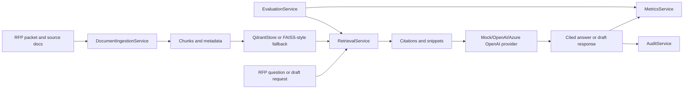

# RFP Response Intelligence Copilot

Sales and presales teams lose days answering RFPs because the evidence is scattered across proposals, product docs, security questionnaires, compliance policies, and pricing notes.

This copilot ingests approved enterprise documents, retrieves grounded evidence, drafts cited RFP answers, flags missing support, and measures quality, latency, tokens, cost, and audit events.

## 30-Second Demo

```bash
python -m pip install -e ".[dev]"
python -m app.demo
python -m app.evals.run_eval --dataset sample_data/eval_dataset.json --top-k 4
```

Expected result: six sample documents load, requirements are extracted, a cited SSO/encryption answer is generated, a five-section draft is created, and the deterministic eval prints `Pass/fail summary: PASS`.

Run the API and dashboard:

```bash
python -m uvicorn app.main:app --reload
python -m streamlit run dashboard/app.py
```

Open API docs at [http://127.0.0.1:8000/docs](http://127.0.0.1:8000/docs) and the dashboard at [http://127.0.0.1:8501](http://127.0.0.1:8501).

## Architecture



## What It Demonstrates

- RAG pipeline design with chunking, retrieval gates, citations, and missing-evidence behavior.
- FastAPI reference APIs with Pydantic models, async service boundaries, trace IDs, and API key auth.
- Local deterministic `MockLLMProvider` plus optional OpenAI and Azure OpenAI provider adapters.
- Vector search through a Qdrant adapter surface and local FAISS-style fallback.
- Document Q&A, requirement extraction, classification, response drafting, and source-grounded summarization.
- Prompt/context engineering patterns that keep generated answers tied to retrieved snippets.
- Token usage, latency, estimated cost, citation coverage, and retrieval precision reporting.
- Optional Azure handoff paths for Azure OpenAI, Azure AI Search, Document Intelligence, Translator, Key Vault, and observability.
- Tests, CI, Docker Compose, sample data, evals, and handoff-quality docs for full-stack and DevOps teams.

## Local Commands

```bash
make install
make test
make dev
make dashboard
make demo
make eval
```

Windows/PowerShell equivalents:

```powershell
python -m pip install -e ".[dev]"
python -m pytest -q
python -m uvicorn app.main:app --reload
python -m streamlit run dashboard/app.py
python -m app.demo
python -m app.evals.run_eval --dataset sample_data/eval_dataset.json --top-k 4
```

## API Snapshot

- `POST /auth/demo-token`: returns a local demo API token.
- `POST /documents/ingest`: ingests a fixture path.
- `POST /documents/ingest-upload`: ingests an uploaded PDF, Markdown, or TXT file.
- `GET /documents`: lists ingested documents.
- `POST /rfp/analyze`: extracts requirements, dates, risks, compliance asks, security questions, pricing mentions, and missing info.
- `POST /rfp/query`: answers a question with citations, confidence, source snippets, trace ID, token usage, and missing-evidence warnings.
- `POST /rfp/draft-response`: creates structured response sections with citations, assumptions, risks, and revision notes.
- `POST /rfp/evaluate`: runs retrieval and grounding evals.
- `GET /metrics/usage`: returns token, latency, cost, retrieval, and request metrics.
- `GET /audit/events`: returns traceable audit events.
- `GET /health`: returns service health, provider mode, vector mode, and version.

## Docker Compose

```bash
docker compose up --build
```

Services:

- API: `http://127.0.0.1:8000`
- Dashboard: `http://127.0.0.1:8501`
- Qdrant: `http://127.0.0.1:6333`

## Configuration

Copy `.env.example` to `.env` for local overrides. Defaults use mock mode and require no paid API keys:

```bash
API_KEY=local-demo-key
PROVIDER_MODE=mock
VECTOR_STORE_MODE=qdrant
```

Set `PROVIDER_MODE=openai` or `PROVIDER_MODE=azure_openai` only after configuring the related keys and deployments.

## Screenshots

Run the API and dashboard, then capture:

- `dashboard/app.py` Ingest Documents tab after loading sample docs.
- Ask Questions tab showing a cited SSO/encryption answer.
- Evaluation and Metrics tab showing precision, coverage, latency, tokens, and estimated cost.

## Repository Map

- `app/`: FastAPI app, models, services, providers, vector stores, eval command, and demo command.
- `dashboard/`: Streamlit internal workflow dashboard.
- `sample_data/`: fake RFP, prior proposal, product, security, compliance, pricing, and eval fixtures.
- `tests/`: pytest coverage for auth, ingestion, retrieval, analysis, query, missing evidence, draft generation, metrics, audit, and eval.
- `docs/`: architecture, API, evaluation, and Azure deployment notes.
